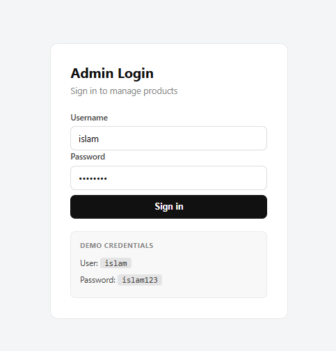
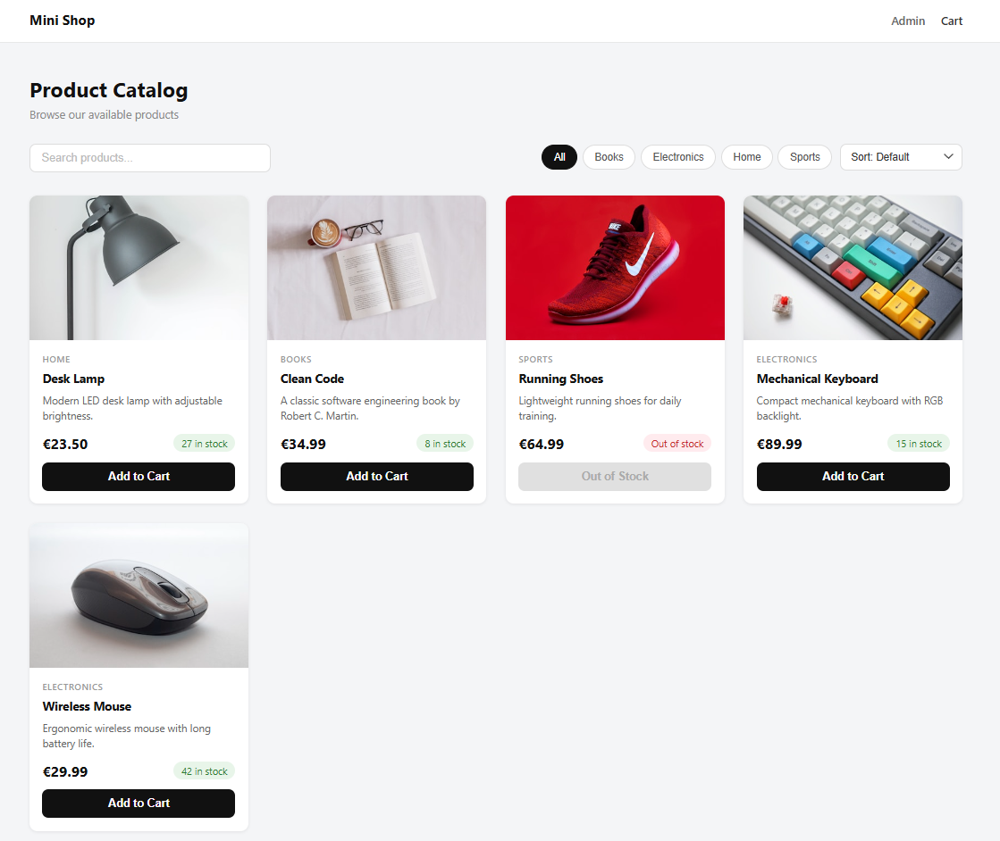
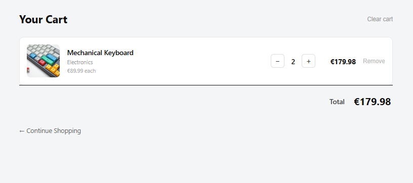

# Mini E-Commerce Product Dashboard

A small educational portfolio project built with **Next.js**, **React**, **TypeScript**, and **Firebase**.

The project simulates a simple e-commerce product dashboard. Users can browse products, search by product name, filter by category, sort by price, and use a simple shopping cart. It also includes a protected admin area where products can be added, edited, and deleted using Firebase Firestore.

This project was built mainly for learning and portfolio practice.

---

## Screenshot





---
## Features

### Storefront

* Display products from Firebase Firestore
* Product cards with image, name, category, price, stock, and description
* Search products by name
* Filter products by category
* Sort products by price

  * Default
  * Low to high
  * High to low
* Loading state while products are being fetched
* Empty state when no products match the search or filter
* Responsive layout for desktop and mobile

### Shopping Cart

* Add products to the cart
* Prevent adding out-of-stock products
* Increase or decrease item quantity
* Quantity cannot go above available stock
* Remove single items from the cart
* Clear the whole cart
* Show subtotal per item
* Show total cart price
* Cart state works while navigating between pages

### Admin Dashboard

* Protected admin page using Firebase Authentication
* Demo login for testing
* View all products in a dashboard table
* Add new products
* Edit existing products
* Update product price and stock
* Delete products
* Loading and error states
* Success and error messages after admin actions

---

## Tech Stack

* Next.js
* React
* TypeScript
* Firebase Firestore
* Firebase Authentication
* CSS Modules
* Git / GitHub

---

## Demo Admin Login

The admin dashboard is protected with Firebase Authentication.

```
## You can visit it:
https://e-Commerce.islamalbadawy.com

---

Demo credentials:

```text
User: islam
Password: islam123
```

The username is mapped internally to a Firebase email account.

```text
islam → islam@islamalbadawy.com
```

This is only for demo and educational use.

---

## Project Structure

```text
mini-ecommerce/
├── app/
│   ├── admin/
│   │   └── page.tsx
│   ├── cart/
│   │   └── page.tsx
│   ├── layout.tsx
│   └── page.tsx
│
├── components/
│   ├── CategoryFilter.tsx
│   ├── Header.tsx
│   ├── ProductCard.tsx
│   ├── SearchBar.tsx
│   └── SortSelect.tsx
│
├── context/
│   ├── AuthContext.tsx
│   └── CartContext.tsx
│
├── lib/
│   ├── auth.ts
│   ├── firebase.ts
│   └── products.ts
│
├── styles/
│   ├── Admin.module.css
│   ├── Cart.module.css
│   ├── Controls.module.css
│   ├── globals.css
│   ├── Header.module.css
│   ├── Home.module.css
│   └── ProductCard.module.css
│
├── types/
│   └── product.ts
│
├── .env.example
├── .gitignore
├── README.md
├── next.config.ts
├── package.json
└── tsconfig.json

## Available Pages

```text
/          Product listing page
/cart      Shopping cart page
/admin     Protected admin dashboard
```

---

## What I Practiced in This Project

* Creating a Next.js project with TypeScript
* Building reusable React components
* Using CSS Modules for styling
* Reading data from Firestore
* Creating, updating, and deleting Firestore documents
* Using Firebase Authentication
* Protecting an admin page
* Working with React Context
* Managing cart state on the client side
* Search, filter, and sort logic
* Loading, error, and empty states
* Responsive layout
* Writing clean commits with Git

---

## Notes

This project is built for educational and portfolio purposes.

The admin login is a simple demo login. For a real production project, more security features would be needed, such as:

* Stronger password policy
* Real user roles
* Admin-only custom claims
* Better form validation
* Image upload instead of image URLs
* More detailed Firestore rules

---

## Possible Future Improvements

* Add product image upload with Firebase Storage
* Add persistent cart using localStorage
* Add real order checkout flow
* Add user roles for admin permissions
* Add product categories management
* Add better form validation
* Add pagination for products
* Add product details page
* Add deployment with Vercel

---

## Project Goal

The goal of this project is not to build a full online shop, but to show practical frontend and Firebase skills in a small, understandable, and realistic project.

It is suitable as a beginner-to-intermediate portfolio project.
